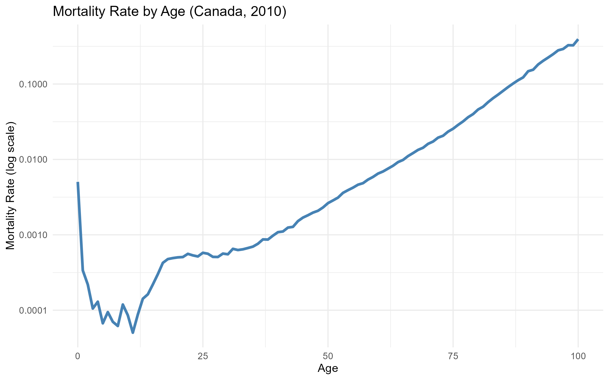
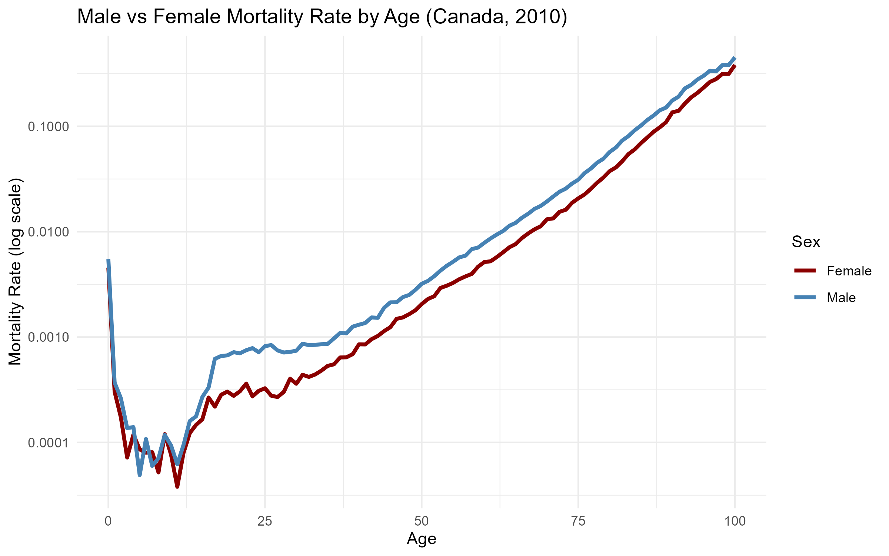
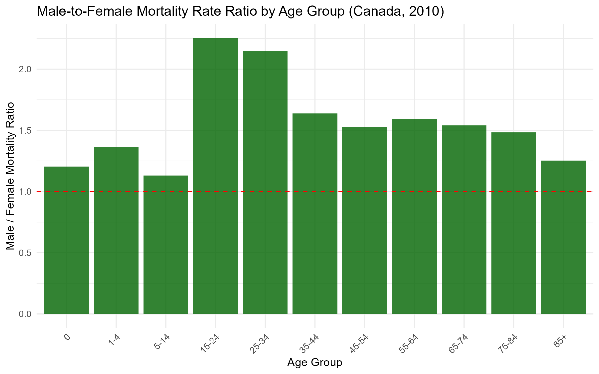
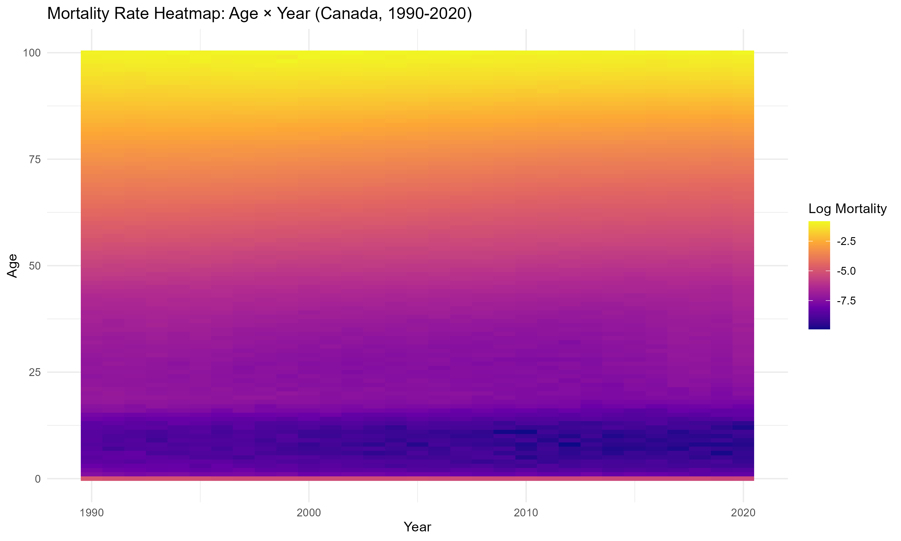
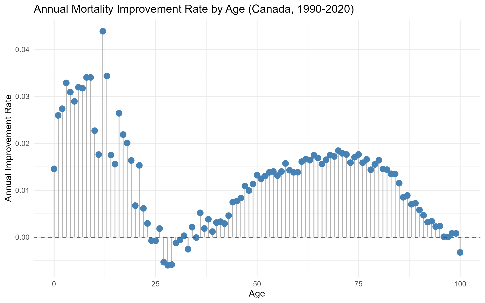
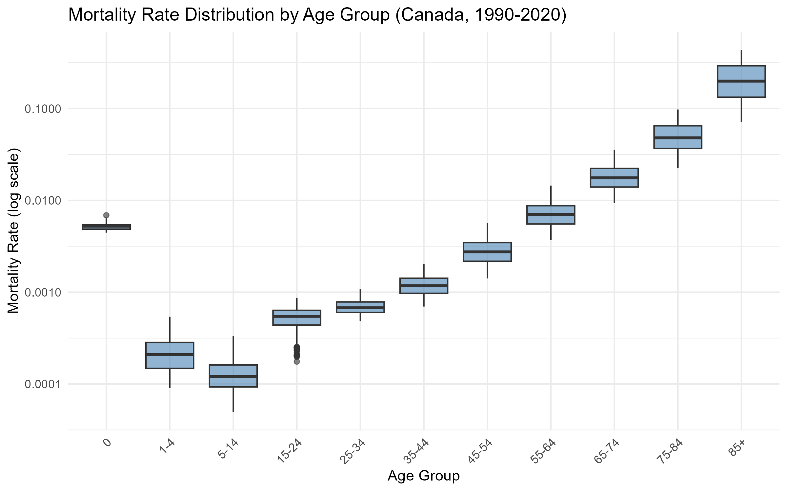
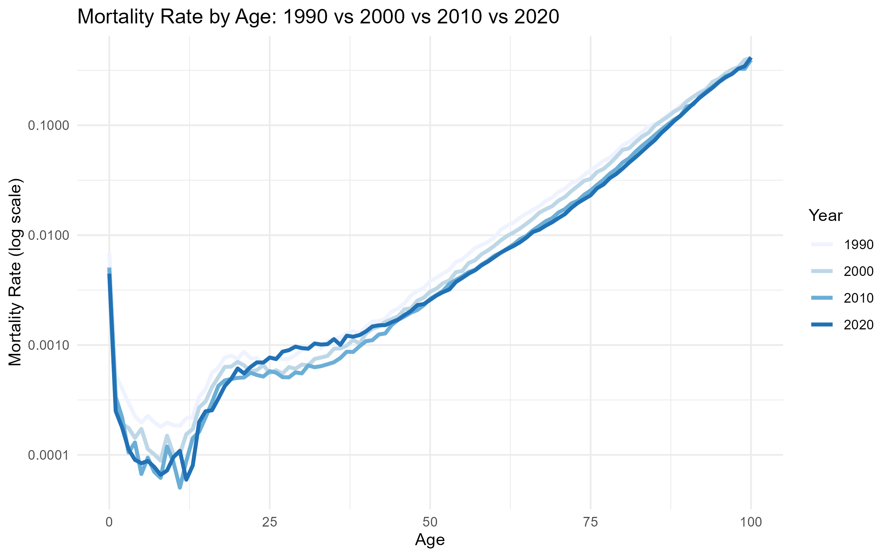
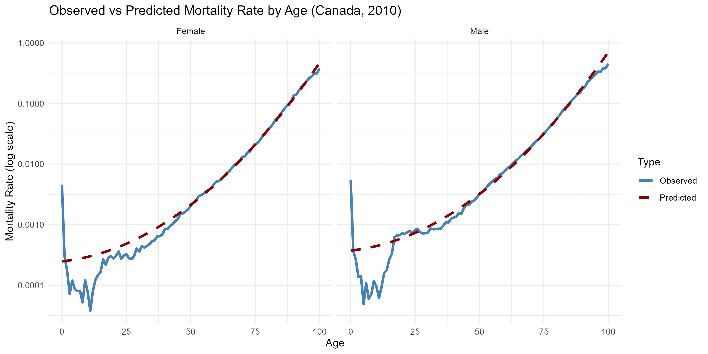
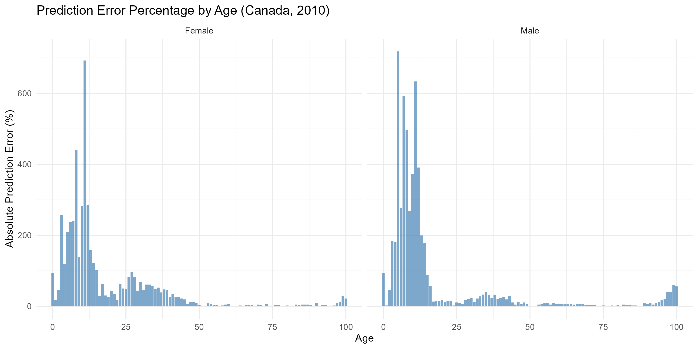

# Mortality Experience Analysis and Statistical Modeling in R

**Author**: Jeff Xie  
**Date**: July 2026  
**Data Source**: Human Mortality Database (HMD) - Canada  
**Time Period**: 1990-2020  
**Age Range**: 0-100  

---

## Overview

This project analyzes mortality experience using Canadian population data from the Human Mortality Database (HMD). The analysis covers the period from 1990 to 2020 across ages 0-100 and examines how mortality varies by age, sex, and calendar year.

The project demonstrates a complete actuarial analytics workflow: data acquisition → data cleaning → exploratory visualization → statistical modeling → model evaluation → reproducible reporting using R.

---

## Project Objectives

1. Analyze mortality patterns by age, sex, and calendar year using real-world population data
2. Quantify mortality improvement trends over a 30-year period (1990-2020)
3. Build and evaluate Poisson GLM models for mortality rates
4. Compare model predictions against observed mortality experience
5. Produce reproducible visualizations suitable for actuarial reporting

---

## Data Source

### Human Mortality Database (HMD)

- Website: www.mortality.org
- Country: Canada
- Data Type: Period 1x1 (single-year age, single-year calendar)
- Variables:
  - Year (1990-2020)
  - Age (0-100)
  - Sex (Male, Female)
  - Exposure (person-years)
  - Mortality Rate (mx = deaths / exposure)

---

## Tools & Technologies

| Tool | Purpose |
|------|---------|
| R 4.6.1 | Core programming language |
| tidyverse | Data manipulation (dplyr, tidyr) and visualization (ggplot2) |
| viridis | Color palettes for heatmaps |
| RStudio | Integrated development environment (IDE) |
| HMD | Source of mortality and exposure data |

R packages used: library(tidyverse), library(viridis)

---

## Project Structure

```
mortality-analysis-r/
│
├── README.md
├── mortality_analysis.R
│
├── data/
│   ├── raw/
│   │   ├── Canada.Exposures_1x1.txt
│   │   └── Canada.Mx_1x1.txt
│   ├── mortality_data_clean.csv
│   └── mortality_data_clean.rds
│
└── output/
    ├── 01_mortality_by_age.png
    ├── 02_male_vs_female.png
    ├── 03_male_female_ratio.png
    ├── 04_mortality_heatmap.png
    ├── 05_mortality_improvement.png
    ├── 06_mortality_boxplot.png
    ├── 07_multi_year_overlay.png
    ├── 08_observed_vs_predicted.png
    └── 09_prediction_error.png
```

## Methodology

### Data Preparation

The raw HMD data consists of two files:
1. Mortality rates (mx): Age-specific death rates for each year
2. Exposures (ex): Person-years at risk for each year

Data processing steps:

| Step | Description |
|------|-------------|
| 1 | Import raw data using read.table() with header = TRUE |
| 2 | Convert Age from character to numeric |
| 3 | Reshape data from wide format to long format |
| 4 | Merge mortality rates with exposures by Year, Age, and Sex |
| 5 | Filter to 1990-2020, ages 0-100, exclude "Total" sex category |
| 6 | Calculate deaths = mortality_rate × exposure |
| 7 | Create age_group variable (11 groups) |
| 8 | Save cleaned data as CSV and RDS formats |

Clean dataset summary:
- Rows: 6,262
- Years: 1990-2020 (31 years)
- Ages: 0-100 (101 ages)
- Sexes: Male, Female
- Columns: year, age, sex, exposure, deaths, mortality_rate, age_group

---

### Exploratory Data Analysis

Nine visualizations were created using ggplot2:

| Plot | Type | Purpose |
|------|------|---------|
| 1 | Line chart | Mortality rate by age (2010) |
| 2 | Line chart (grouped) | Male vs female mortality (2010) |
| 3 | Bar chart | Male-to-female mortality ratio by age group (2010) |
| 4 | Heatmap | Mortality rate across age × year (1990-2020) |
| 5 | Lollipop chart | Annual mortality improvement rate by age (1990-2020) |
| 6 | Boxplot | Mortality rate distribution by age group (1990-2020) |
| 7 | Line chart (multi-year) | Mortality curves: 1990 vs 2000 vs 2010 vs 2020 |
| 8 | Line chart (dual) | Observed vs predicted mortality (model assessment) |
| 9 | Bar chart (faceted) | Prediction error percentage by age and sex |

---

### Statistical Modeling

Model Type: Poisson Generalized Linear Model (GLM) with log link

Model 1 (Linear):
log(mortality) = beta0 + beta1 * Age + beta2 * Sex

Model 2 (Quadratic):
log(mortality) = beta0 + beta1 * Age + beta2 * Age^2 + beta3 * Sex

The quadratic term captures the accelerating increase in mortality at older ages.

### Model Evaluation

Two approaches were used to evaluate model performance:
1. AIC comparison between Model 1 and Model 2
2. Visual assessment: Observed vs predicted mortality (Plot 8) and prediction error percentage (Plot 9)

---

## Key Findings

### 1. Age-Related Mortality

Mortality rates increase with age, with the rate of increase accelerating substantially after age 40-50. This is consistent with actuarial expectations.

### 2. Gender Differences

Male mortality is consistently higher than female mortality across all age groups. The male-to-female mortality ratio ranges from 1.1 to 2.3 depending on age, with the largest gaps in young adults (ages 20-40) and the elderly (ages 70+).

### 3. Mortality Improvement (1990-2020)

Over the 30-year study period:
- All age groups experienced mortality improvement
- Children and young adults saw the most significant improvements
- Elderly populations (75+) saw more modest improvements

### 4. GLM Model Results

Model Comparison (AIC):

Model 2 (with age^2) provides a better fit than Model 1, confirming that the quadratic age term is necessary.

Model 2 Coefficients:

| Predictor | Estimate | Interpretation |
|-----------|----------|----------------|
| Intercept | -8.303 | Baseline log mortality |
| age | 0.01068 | 1-year age increase → ~1.07% higher mortality |
| age^2 | 0.0006474 | Accelerating increase at older ages |
| sexMale | 0.4122 | Male mortality ≈ 1.51x female mortality |

All coefficients are statistically significant (p < 0.001).

---

## Visualizations

### Plot 1: Mortality Rate by Age (Canada, 2010)



### Plot 2: Male vs Female Mortality (Canada, 2010)



### Plot 3: Male-to-Female Mortality Ratio by Age Group (Canada, 2010)



### Plot 4: Mortality Heatmap: Age x Year (Canada, 1990-2020)



### Plot 5: Annual Mortality Improvement Rate (Canada, 1990-2020)



### Plot 6: Mortality Rate Distribution by Age Group (Canada, 1990-2020)



### Plot 7: Mortality Rate by Age: 1990 vs 2000 vs 2010 vs 2020



### Plot 8: Observed vs Predicted Mortality (Canada, 2010)



### Plot 9: Prediction Error Percentage by Age (Canada, 2010)



---

## Model Results

### Final Model (Poisson GLM)

deaths ~ age + I(age^2) + sex, offset = log(exposure), family = poisson(link = "log")

### Model Summary

Coefficients:
            Estimate Std. Error z value Pr(>|z|)    
(Intercept) -8.303e+00  1.926e-02  -431.21   <2e-16 ***
age          1.068e-02  6.024e-04    17.73   <2e-16 ***
I(age^2)     6.474e-04  4.649e-06   139.25   <2e-16 ***
sexMale      4.122e-01  4.167e-03    98.93   <2e-16 ***

### Mathematical Formula

log(mx) = -8.303 + 0.01068 * Age + 0.0006474 * Age^2 + 0.4122 * SexMale

or equivalently:

mx = exp(-8.303 + 0.01068 * Age + 0.0006474 * Age^2 + 0.4122 * SexMale)

### Interpretation

- Age effect: Every additional year of age increases mortality by approximately 1.07%
- Age^2 effect: Positive quadratic term means mortality accelerates at older ages
- Sex effect: Male mortality is approximately 51% higher than female mortality

---

## How to Run This Project

### Prerequisites

1. R (version 4.0 or higher)
2. RStudio (recommended)

### Step 1: Download HMD Data

1. Register at www.mortality.org
2. Navigate to Canada -> Period data
3. Download:
   - Age-Specific Death Rates (Mx) -> 1x1 format
   - Exposure-to-risk -> 1x1 format
4. Save both files to data/raw/

### Step 2: Set Working Directory

In mortality_analysis.R, update the setwd() path:

setwd("C:/Your/Path/To/mortality-analysis-r")

### Step 3: Install Required Packages

In RStudio, run:

install.packages(c("tidyverse", "viridis"))

### Step 4: Run the Analysis

1. Open mortality_analysis.R in RStudio
2. Click the Source button
3. All plots will be saved to the output/ folder

---

## Limitations

- Single country (Canada) only; findings may not generalize to other populations
- Time period 1990-2020; does not include COVID-19 impact
- Poisson GLM assumes deaths follow Poisson distribution
- Model performance degrades at age 85+ due to sparse data
- Only age and sex are used as predictors

---

## References

- Human Mortality Database. University of California, Berkeley, and Max Planck Institute for Demographic Research. www.mortality.org
- SOA Exam FAM - Life Contingencies
- SOA Exam SRM - Statistics for Risk Modeling
- SOA Exam PA - Predictive Analytics
- Wickham, H., & Grolemund, G. (2017). R for Data Science. O'Reilly Media.

---

## Connect with Me

- LinkedIn: linkedin.com/in/jeff-haonan-xie-05530b164
- GitHub: github.com/jeffxhn
- Email: jeffxhn@gmail.com

---

Last Updated: July 2026
